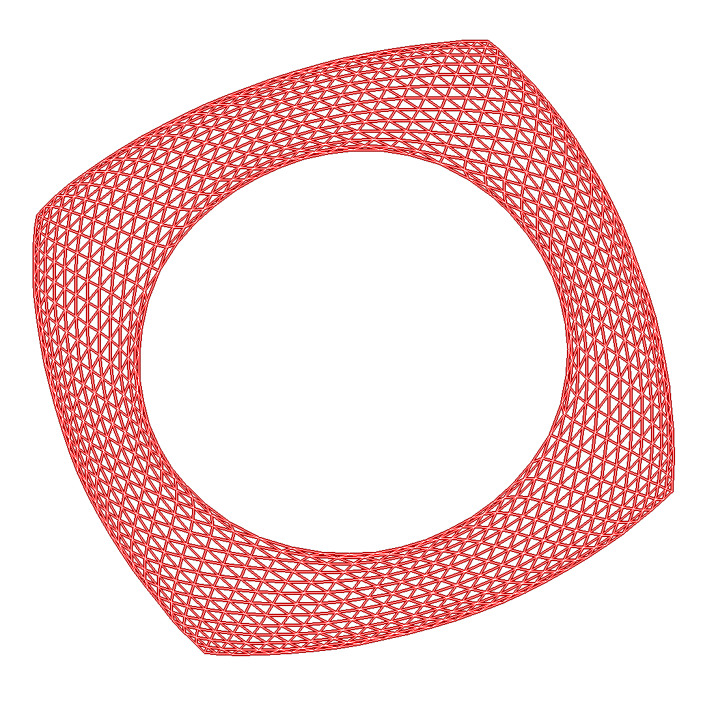
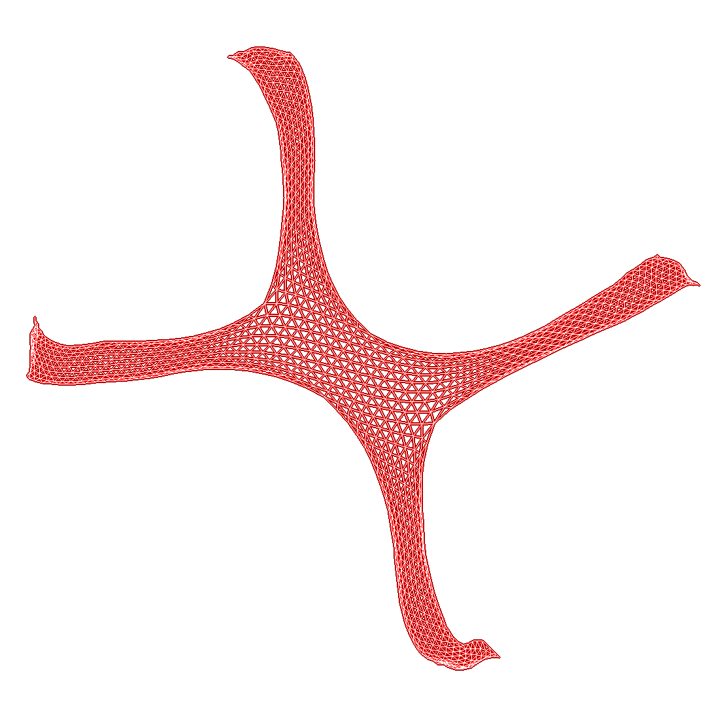

# Zhifeng's Graph Visualization Collection

This collection stores the graphs I have visualized using Multi-level Force Directed Layout Algorithm with Barnes Hut Tree. The algorithm originally comes from Yifan Hu 's _Efficient and High Quality Force-Directed Graph Drawing_.

Some graph data is my original work, such as 1111 which is a graph representing a finger-tip game. The rest of the data come from [Network Repository](https://networkrepository.com/), [Spare Matrix Collection of TAMU](https://sparse.tamu.edu/), and [Matrix Market](https://math.nist.gov/).

---

